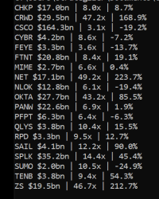

# Comparables Generator

Uses the [AlphaVantage API](https://www.alphavantage.co/documentation/) to pull the current [market capitalization](https://www.investopedia.com/terms/m/marketcapitalization.asp), [Enterprise Value (EV)-to-Revenue multiple](https://www.investopedia.com/terms/e/ev-revenue-multiple.asp), and year-to-date (YTD) stock price change for a specified list of publicly traded companies. Each stat is delinated by a pipe in the output, as shown here:

My personal use case is to compare valuations and stonk price performance across information security companies for a private ~bi-monthly newsletter. I don't think this would be very useful for day trading, but I also don't recommend day trading unless that is your day job (unless you enjoy being a tasty victim for hedge funds).
 
Other relevant metrics one could add to this include EV-to-EBITDA, Quarterly Revenue Growth, or P/E Ratio. Note that most "hot" tech companies are unlikely to be profitable.

## Caveats
There is a built-in 60 second delay for each request due to AlphaVantage's rate limiting (a maximum of 5 requests per minute). If you buy a premium account, then you can adjust accordingly.

You need to wait at least a day post-IPO before adding a company to the list. Currently, companies who IPO'd within the last year are handled by looking up the earliest daily open price, which is different than the IPO price.

Right now, it treats all monetary values as U.S. Dollars (USD), so conversion would be needed for companies whose financials are presented in other currencies.